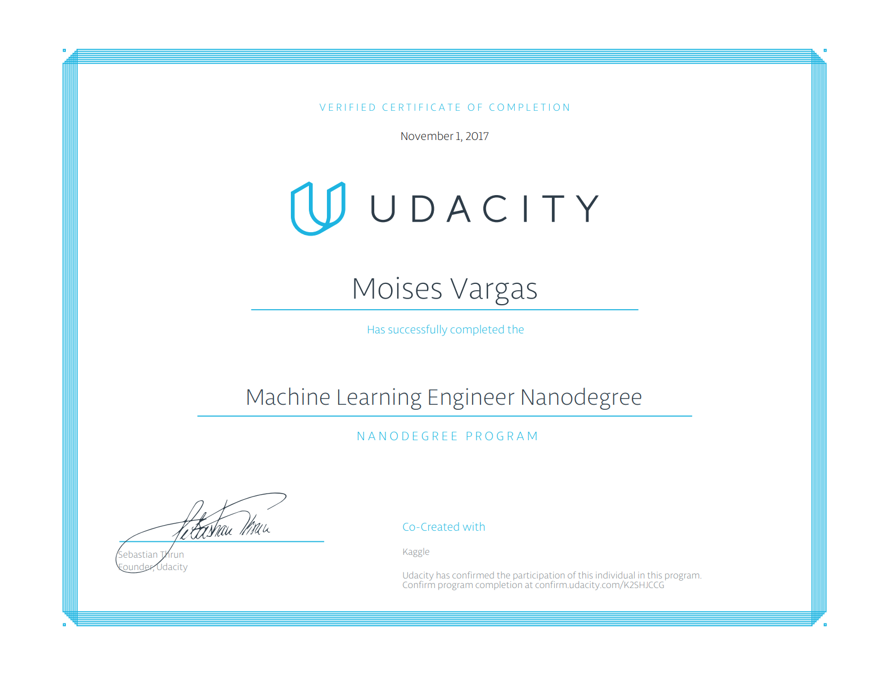
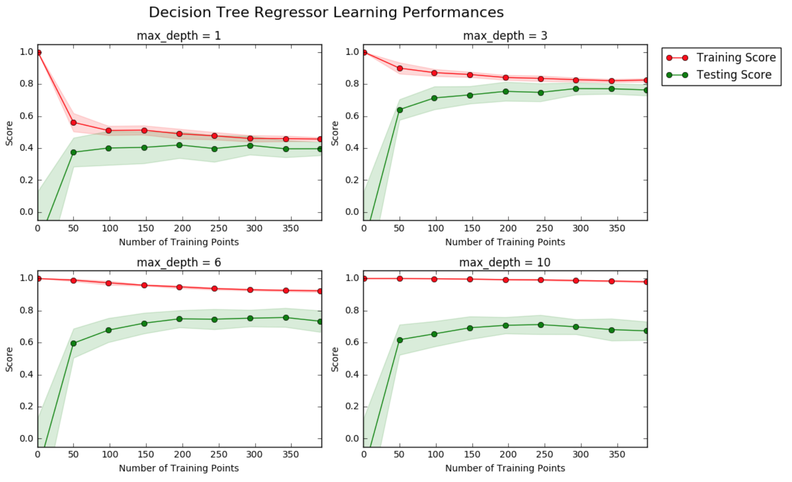
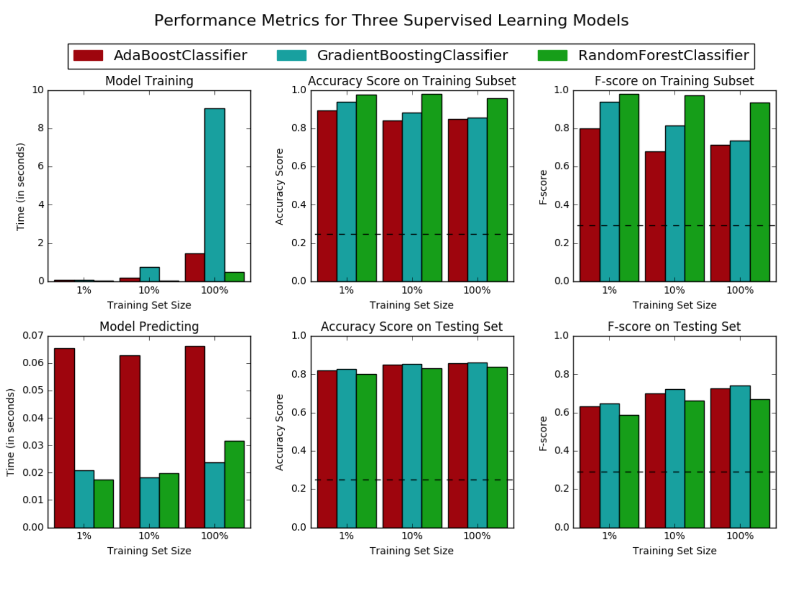
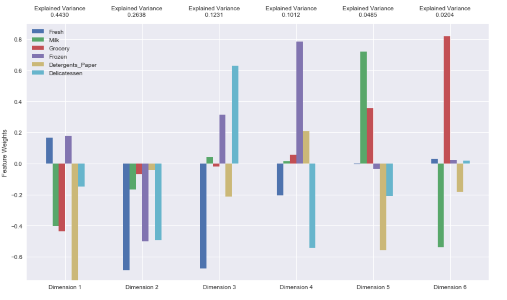
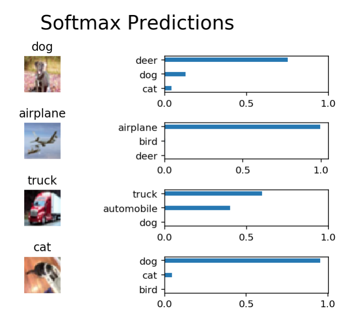
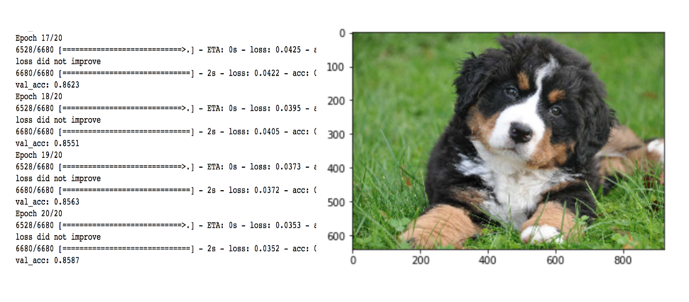
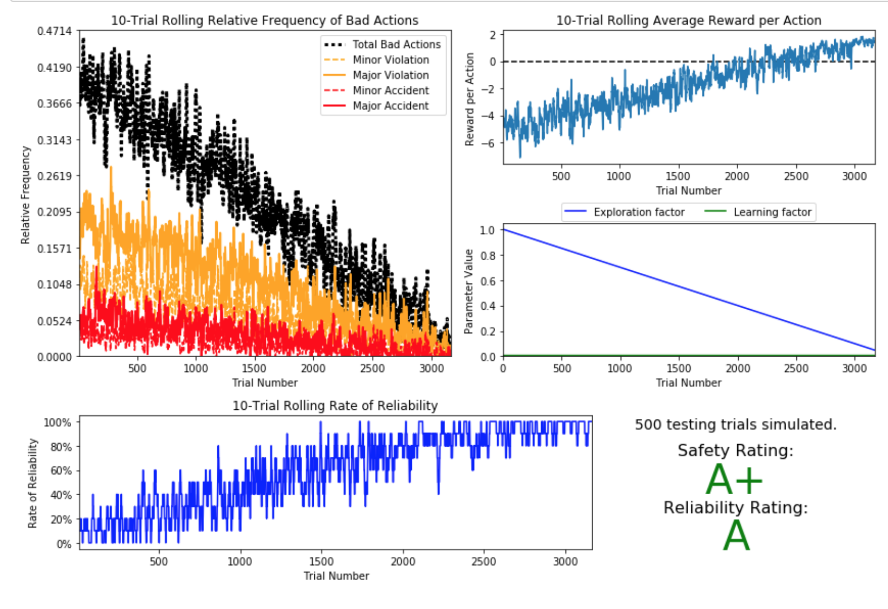
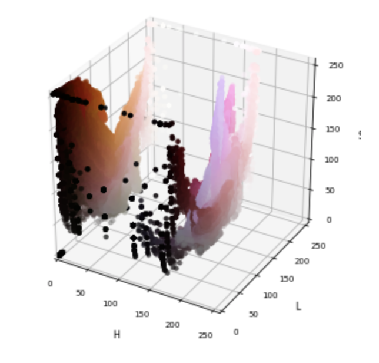

Machine Learning Engineer Nanodegree
====================================

### About

This repository contains projects associated with Udacity's [Machine Learning Engineer Nanodegree](https://www.udacity.com/course/nd009).

### Projects

#### [1 - Predicting Boston Housing Pricing](1-boston_housing)

Built a model to predict the value of a given house in the Boston real estate market using various statistical analysis tools. Identified the best price that a client can sell their house utilizing machine learning.

#### [2 - Finding Donors for CharityML](2-finding_donors)

Investigated factors that affect the likelihood of charity donations being made based on real census data. Developed a naive classifier to compare testing results to. Trained and tested several supervised machine learning models on preprocessed census data to predict the likelihood of donations. Selected the best model based on accuracy, a modified F-scoring metric, and algorithm efficiency.

#### [3 - Creating Customer Segments](3-customer_segments)

Reviewed unstructured data to understand the patterns and natural categories that the data fits into. Used multiple algorithms and both empirically and theoretically compared and contrasted their results. Made predictions about the natural categories of multiple types in a dataset, then checked these predictions against the result of unsupervised analysis.

#### [4 - Object Classification](4-object-classification)

Implemented a convolutional neural network to classify images from the CIFAR-10 dataset

#### [5 - Dog Breed Classifier](5-dog-breed)

Built an algorithm to identify canine breed given an image of a dog. If given image of a human, the algorithm identifies a resembling dog breed.

#### [6 - Training a Smartcab to Drive](6-smartcab)

Applied reinforcement learning to build a simulated vehicle navigation agent. This project involved modeling a complex control problem in terms of limited available inputs, and designing a scheme to automatically learn an optimal driving strategy based on rewards and penalties.

#### [7 - Deep Learning on Cervix Screening](7-cervix-screening)

Built a Convolutional Neural Network (ConvNet) that given a cervix image the network predicts to which type of cervix the image belong.

